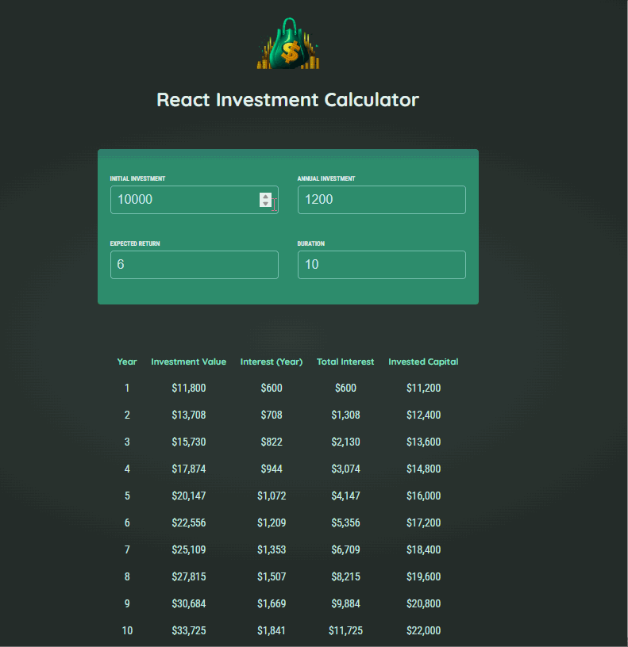

# Investment Calculator (React)

This is a simple investment calculator built using React. It helps users estimate the future value of an investment based on initial investment, interest rate, duration, and additional contributions.



## Features
- User-friendly interface for inputting investment details
- Real-time calculation of future investment value
- Built with React functional components and hooks

## Installation

1. Clone the repository:
   ```sh
   git clone https://github.com/Manar-Moh/investment-calculator-react.git
   cd investment-calculator-react
   ```

2. Install dependencies:
   ```sh
   npm install
   ```

3. Start the development server:
   ```sh
   npm start
   ```

4. Open your browser and go to `http://localhost:3000` to use the calculator.

## How to Use
1. Enter the initial and annual investment amount.
2. Set the expected return.
3. Choose the investment duration in years .
5. View the projected investment growth in real-time.

## Technologies Used
- React (with Hooks)
- JavaScript (ES6+)
- CSS (for styling)

## Contributing
Contributions are welcome! Feel free to fork the repository, make improvements, and submit a pull request.

## License
This project is open-source and available under the [MIT License](LICENSE).

